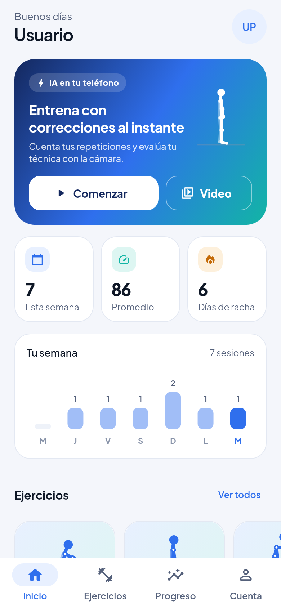
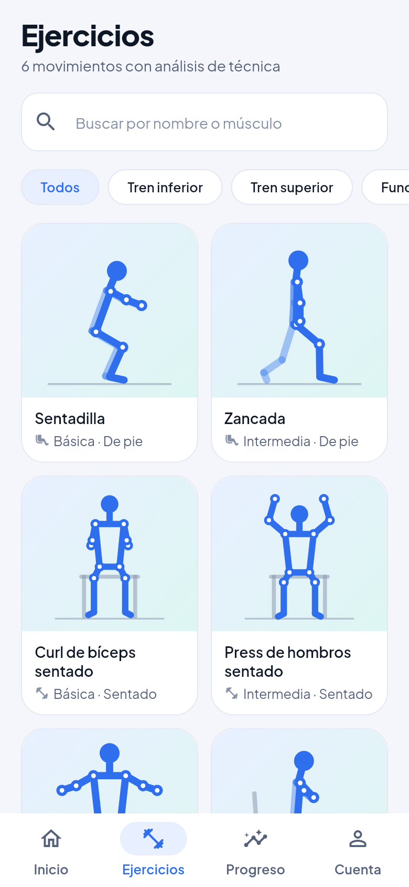
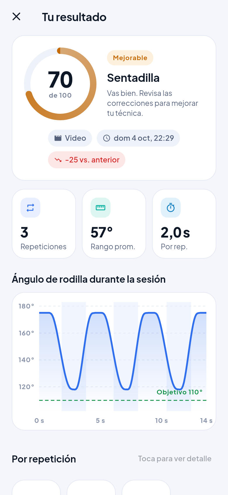
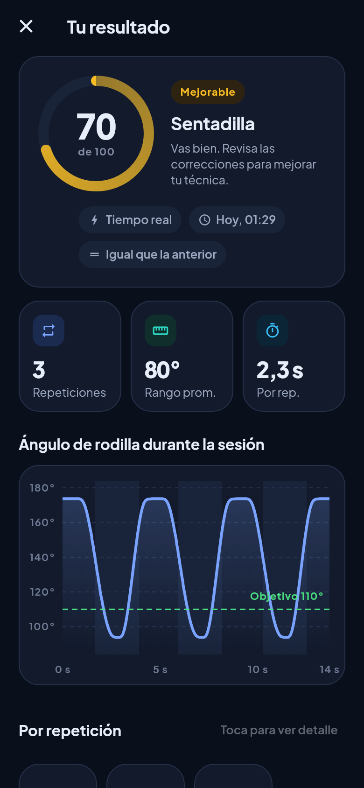

# Proyecto Movimiento — Análisis de movimiento con IA (Flutter + Python)

Aplicación móvil para **Android e iOS** que analiza la técnica de ejercicios a partir de la cámara del
teléfono. Detecta 33 puntos del cuerpo, cuenta repeticiones, evalúa cada una y entrega correcciones
claras, en tiempo real o a partir de un video.

> Prototipo en desarrollo (TRL 3–4). Es un apoyo para la práctica de ejercicio y **no reemplaza la
> evaluación de un profesional de la salud**. Los umbrales del análisis aún deben validarse clínicamente.

<p align="center">
  
  
  
  
</p>

## Qué hace

- **Tiempo real en el teléfono** (sin servidor ni internet): guía de encuadre, cuenta regresiva,
  esqueleto sobre la cámara, contador de repeticiones, avisos visuales y por voz.
- **Análisis de video** en el servidor (grabar o elegir de la galería).
- **Resultado detallado:** puntaje, gráfico del movimiento, detalle por repetición, correcciones
  priorizadas, aciertos y calidad del registro.
- **Progreso:** evolución del puntaje, correcciones más frecuentes e historial.
- **6 ejercicios:** sentadilla, zancada, curl de bíceps sentado, press de hombros sentado, elevación
  lateral y sentarse-pararse.

## Cómo funciona

```
compartido/ejercicios.json   ← reglas únicas: ejercicios, umbrales, códigos y mensajes
        │
        ├── app/lib/motor/      motor en Dart  → tiempo real con ML Kit en el teléfono
        └── servidor/motor/     motor en Python → análisis de video con MediaPipe
```

Ambos motores aplican las mismas reglas y se verifican con los mismos escenarios de prueba
(`compartido/fixtures/`), por lo que un ejercicio se evalúa igual en vivo que por video.

Por cada ejercicio, el motor: (1) calcula ángulos y alineaciones (normalizados por tamaño corporal),
(2) los suaviza (filtro One Euro), (3) detecta repeticiones con una máquina de estados y (4) evalúa cada
repetición con reglas por severidad, considerando la vista de la cámara (frente o costado).

## Estructura

| Carpeta | Contenido |
|---------|-----------|
| `app/` | App Flutter (Riverpod, go_router, cámara + ML Kit, gráficos). Ver [app/README.md](app/README.md). |
| `servidor/` | API FastAPI + motor Python + herramienta de webcam. Ver [servidor/README.md](servidor/README.md). |
| `compartido/` | Especificación de ejercicios y escenarios de prueba comunes. |
| `docs/` | [Propuesta de mejoras](docs/PROPUESTA_MEJORAS.md), [plan de implementación](docs/PLAN_IMPLEMENTACION.md) y capturas. |

## Inicio rápido

### 1. Servidor (solo necesario para analizar videos)

Requiere Python 3.10+ (recomendado 3.12).

```bash
cd servidor
python -m venv venv
# Windows: venv\Scripts\activate   ·   Linux/macOS: source venv/bin/activate
pip install -r requirements.txt
uvicorn servidor:app --reload --host 0.0.0.0 --port 8000
```

Comprueba que responde en <http://localhost:8000/salud>.

### 2. App

Requiere Flutter 3.44 o superior (probado con 3.47). iOS 15.5+ y Android 7.0 (API 24)+.

```bash
cd app
flutter pub get
flutter run
```

Credenciales de demostración: `usuario.prueba` / `1234` (botón **Usar** en la pantalla de login).

### Conexión app → servidor

La dirección se cambia en la app: **Cuenta → Servidor de análisis de video → Cambiar** (con botón
**Probar**). También puede fijarse al compilar: `flutter run --dart-define=API_URL=http://192.168.1.50:8000`.

- Emulador de Android: `http://10.0.2.2:8000` (valor por defecto).
- Simulador de iOS: `http://localhost:8000`.
- Teléfono físico: la IP local del computador, en la misma red Wi-Fi.

> El modo **tiempo real** funciona sin servidor. La detección de pose en vivo usa ML Kit, que requiere un
> dispositivo físico o un emulador con cámara; en iOS conviene probar en un iPhone real.

## Pruebas

```bash
cd servidor && pip install -r requirements-dev.txt && pytest      # 32 tests
cd app && flutter analyze && flutter test                         # 42 tests
cd app && flutter test test_capturas --update-goldens             # regenera docs/capturas
```

## Documentación

- [Propuesta de mejoras](docs/PROPUESTA_MEJORAS.md): diagnóstico del prototipo original, qué se
  implementó y qué falta (modelo, app, escala y cumplimiento).
- [Plan de implementación](docs/PLAN_IMPLEMENTACION.md): fases hacia TRL 4–5 con tareas y criterios de
  aceptación.

## Autores

- **Esteban Salgado** — Responsable del desarrollo del modelo de IA, el backend y la integración del análisis de movimiento.
- **Martín Ulloa (MartinUlloaG)** — Responsable del apartado visual y del desarrollo de la aplicación móvil en Flutter.
